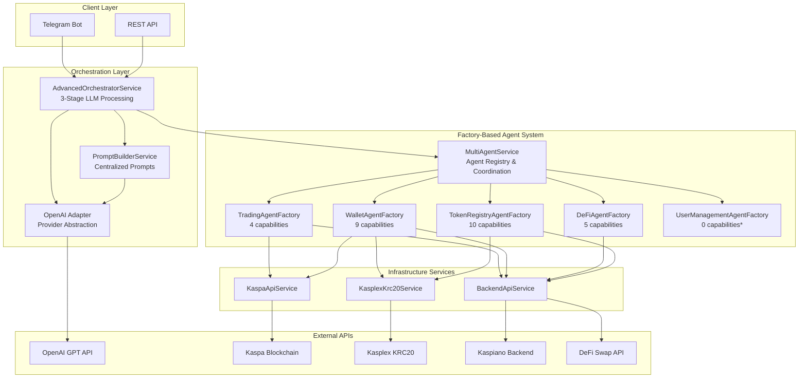
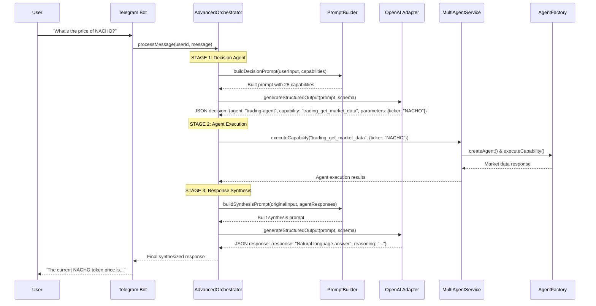

# Kaspa DeFi Agent Orchestration System

A sophisticated **factory-based multi-agent system** built for the Kaspa ecosystem, featuring **real OpenAI LLM integration**, intelligent agent coordination, and **28 production-ready capabilities** across 5 specialized domain agents.

## ✨ Key Features

- 🤖 **Real LLM Integration** - OpenAI GPT-powered decision making and response synthesis
- 🏭 **Factory-Based Architecture** - Dynamic agent creation with capability injection
- 🎯 **3-Stage LLM Orchestration** - Decision → Execution → Synthesis workflow
- 📝 **Centralized Prompt Management** - Template-based prompts with variable substitution
- 🔄 **Provider-Agnostic LLM Layer** - Easy to switch between OpenAI, Claude, etc.
- 🧠 **Intelligent Agent Routing** - LLM decides which agents to call dynamically
- 💬 **Live Telegram Integration** - Working bot with real conversational AI
- 🔐 **Authentication-Aware** - Public capabilities ready, wallet auth documented
- 🏗️ **Modular Architecture** - Clean separation with dependency injection

## 🏗️ Current Architecture Overview



*Note: UserManagementAgentFactory has 0 active capabilities (all require wallet authentication)*

## 🎯 Current Capability Overview

### **📊 Total: 28 Active Capabilities**

| Agent | Active Capabilities | Auth Status |
|-------|-------------------|------------|
| **Trading Agent** | 4 | ✅ Public APIs only |
| **Wallet Agent** | 9 | ✅ Blockchain read-only |
| **DeFi Agent** | 5 | ✅ Backend APIs only |
| **Token Registry Agent** | 10 | ✅ Public data only |
| **User Management Agent** | 0 | 🔐 All require wallet auth |
| **TOTAL** | **28** | **28 ready + 6 auth-pending** |

### 🔄 **Trading Agent (4 capabilities)**
- `trading_get_market_data` - Market prices and statistics
- `trading_get_floor_price` - Token floor price data
- `trading_get_sell_orders` - Marketplace order listings
- `trading_gas_estimation` - Transaction fee estimates

*Commented out (3): sell order creation, token buying, order confirmation (require PSKT + wallet auth)*

### 💰 **Wallet Agent (9 capabilities)**
- `wallet_get_portfolio` - Complete portfolio overview
- `wallet_get_token_balance` - Specific token balances
- `wallet_get_kaspa_balance` - KAS balance checking
- `wallet_get_activity` - Transaction history
- `wallet_get_token_list` - Available tokens
- `wallet_validate_address` - Address validation
- `wallet_get_utxos` - UTXO analysis
- `wallet_get_fee_estimate` - Fee calculations
- `wallet_get_kaspa_price` - Current KAS price

*All use public blockchain APIs (Kaspa API, Kasplex API) - no authentication required*

### 🔄 **DeFi Agent (5 capabilities)**
- `defi_get_token_info` - Token information lookup
- `defi_search_tokens` - Token search functionality
- `defi_create_token` - Token creation guidance
- `defi_create_pool` - Pool creation guidance
- `defi_general_query` - Educational DeFi information

*Smart contract operations documented for future wallet integration*

### 🏷️ **Token Registry Agent (10 capabilities)**
- `token_get_info` - Complete token information
- `token_search` - Token search by criteria
- `token_list_all` - Full token catalog
- `token_get_price_history` - Historical price data
- `token_get_holders` - Token holder statistics
- `token_get_price` - Current token pricing
- `token_count_total` - Total token counts
- `token_get_kasplex_info` - Kasplex token data
- `token_check_deployment` - Deployment verification
- `token_get_mint_status` - Minting status check

*All public token registry and Kasplex endpoints*

### 👤 **User Management Agent (0 active capabilities)**
*All 3 original capabilities require wallet authentication:*
- User notifications (requires session)
- Wallet activity data (requires session)
- Contact information (requires session)

## 🔐 Authentication Architecture

### **Current Status: Authentication-Aware Design**

#### ✅ **Ready Now (28 capabilities)**
- **Public APIs**: Market data, token information, blockchain queries
- **No Authentication Required**: Direct API access without user sessions
- **Immediate Functionality**: Works for all users without setup

#### 🚧 **Future Implementation (6 capabilities)**
- **Wallet Authentication Required**: Trading operations, user data
- **Implementation Ready**: All auth endpoints documented
- **Clear Roadmap**: Headers, session management, error handling defined

#### **Authentication Requirements (from kaspacom.md analysis)**
```typescript
// Required for wallet-auth capabilities
headers: {
  "Content-Type": "application/json",
  "Authorization": "Bearer <jwt_token>"
  // OR session cookies handled automatically
}

// PSKT (Partially Signed Kaspa Transaction) for trading
// Wallet signature verification for user sessions
// Error handling: 401 Unauthorized, 403 Forbidden
```

## 🔄 3-Stage LLM Processing Flow



## 🏭 Factory-Based Architecture

### **Why Factory Pattern?**
- ✅ **Dynamic Agent Creation**: Agents created on-demand with injected capabilities
- ✅ **Clean Separation**: No more agent service files, just focused factories
- ✅ **Easy Capability Management**: Add/remove capabilities without service changes
- ✅ **Real Service Integration**: Direct injection of working API services
- ✅ **Authentication Awareness**: Clear separation of public vs auth-required

### **Factory Structure**
```
src/modules/integrations/openserv/agents/factories/
├── trading-agent.factory.ts        # 4 public market capabilities
├── wallet-agent.factory.ts         # 9 blockchain read capabilities  
├── defi-agent.factory.ts           # 5 backend API capabilities
├── token-registry-agent.factory.ts # 10 public token capabilities
├── user-management-agent.factory.ts # 0 active (auth-required commented)
└── agent-builder.service.ts        # Factory builder pattern
```

### **Factory Benefits Over Services**
- **No Placeholder Methods**: Only real, working capabilities included
- **Service Injection**: Direct integration with BackendApiService, KaspaApiService, etc.
- **Authentication Boundaries**: Clear separation of public vs private operations
- **Maintainable**: Easy to add capabilities without architectural changes

## 📝 Centralized Prompt Management

### Template-Based System
```
src/modules/prompt-builder/
├── prompt-builder.module.ts      # Module that any service can import
├── prompt-builder.service.ts     # Core prompt building logic
├── models/prompt.interfaces.ts   # Type-safe prompt interfaces
└── prompts/
    ├── orchestrator/
    │   ├── decision-agent.prompt.ts    # LLM decision prompts (28 capabilities)
    │   └── synthesis-agent.prompt.ts   # Response synthesis prompts
    └── openserv/
        └── routing-agent.prompt.ts     # Routing logic prompts
```

### Template Features
- ✅ **28 Capability Awareness** - LLM knows all available agent capabilities
- ✅ **Authentication Context** - Distinguishes public vs auth-required capabilities
- ✅ **Variable Substitution** - `{{userInput}}`, `{{agentCapabilities}}`, etc.
- ✅ **Context-Aware** - Session history and user preferences
- ✅ **Type-Safe** - TypeScript interfaces for all prompt contexts
- ✅ **Kaspa-Specific** - Pre-loaded with KRC20 token knowledge

## 🧠 LLM Abstraction Layer

### Provider-Agnostic Design
```typescript
// Generic LLM interfaces - works with any provider
interface LlmConversation {
  messages: LlmMessage[];
  metadata?: Record<string, any>;
}

interface LlmAdapter {
  generateCompletion(conversation: LlmConversation): Promise<string>;
  generateStructuredOutput<T>(conversation: LlmConversation, schema: object): Promise<T>;
}
```

### Current Implementation
- ✅ **OpenAI Integration** - Real GPT API calls with structured outputs
- ✅ **Provider Abstraction** - Easy to add Claude, Anthropic, etc.
- ✅ **Error Handling** - Graceful fallbacks when LLM calls fail
- ✅ **Temperature Control** - Different settings for decision vs synthesis
- ✅ **28-Capability Context** - LLM understands all available capabilities

## 🎯 Current Implementation Status

### ✅ **Production-Ready Features**

#### **🏭 Factory-Based Multi-Agent System**
- 5 agent factories with 28 total capabilities
- Dynamic agent creation with capability injection
- Clean separation of public vs authentication-required operations
- Real service integration (no placeholder methods)

#### **🤖 Real LLM Integration**
- OpenAI GPT-4 integration with structured outputs
- 3-stage orchestration (Decision → Execution → Synthesis)
- Intelligent routing across 28 capabilities
- Context-aware prompt generation with authentication boundaries

#### **💬 Live Telegram Bot**
- Real-time message processing with 28 available capabilities
- Session management with memory
- Multi-agent coordination through factories
- Natural language responses
- Working in production environment

#### **🔐 Authentication Architecture**
- **28 Public Capabilities**: Ready for immediate use
- **6 Auth-Required Capabilities**: Documented for future implementation
- **Clear Boundaries**: Separation between public APIs and wallet operations
- **Implementation Roadmap**: Headers, sessions, PSKT requirements documented

#### **📊 Infrastructure**
- Kaspa blockchain API integration
- Kasplex KRC20 token support
- Kaspiano backend connectivity
- DeFi swap API integration
- Health monitoring and logging

### 🚧 **Next Phase: Wallet Authentication**

#### **🔐 Wallet Auth Implementation**
- User wallet signin flow implementation
- Session token management
- PSKT signature verification
- 6 additional trading and user management capabilities

#### **💾 Enhanced Features**
- Database session storage (currently in-memory)
- User preference persistence
- Conversation history database
- Analytics and usage tracking

## 🚀 Getting Started

### Prerequisites
- Node.js 18+
- OpenAI API key
- Telegram Bot Token
- Environment configuration

### Installation
```bash
# Install dependencies
npm install

# Set up environment variables
cp .env.example .env
# Edit .env with your API keys

# Start development server
npm run start:dev
```

### Required Environment Variables
```env
# OpenAI Integration
OPENAI_API_KEY=your_openai_api_key
OPENAI_MODEL_NAME=gpt-4

# Telegram Bot
TELEGRAM_BOT_TOKEN=your_telegram_bot_token
TELEGRAM_CHANNEL_ID=your_channel_id

# External APIs
KASPA_API_BASE_URL=https://api.kaspa.org
KASPLEX_API_BASE_URL=https://api.kasplex.org/v1
BACKEND_API_BASE_URL=https://api.kaspiano.com
DEFI_API_BASE_URL=https://dev-api.kaspa.com
USER_API_BASE_URL=https://users.kaspiano.com
```

## 📱 Real Usage Examples

### Live Telegram Interactions

```
User: "what's the price of nacho?"

System Flow:
1. 🧠 LLM Decision: Route to trading-agent → trading_get_market_data
2. 🏭 Factory Execution: TradingAgentFactory creates agent & calls BackendApiService
3. ✨ LLM Synthesis: Generate natural response from market data

Bot: "The current NACHO token price is showing strong market activity..."
```

```
User: "show me KAS token information"

System Flow:
1. 🧠 LLM Decision: Route to token-registry-agent → token_get_info
2. 🏭 Factory Execution: TokenRegistryAgentFactory fetches comprehensive data
3. ✨ LLM Synthesis: Create detailed token overview

Bot: "KAS (Kaspa) is the native token of the Kaspa blockchain with..."
```

```
User: "what's in my wallet kaspa1qr3..."

System Flow:
1. 🧠 LLM Decision: Route to wallet-agent → wallet_get_portfolio
2. 🏭 Factory Execution: WalletAgentFactory queries blockchain APIs
3. ✨ LLM Synthesis: Portfolio breakdown and analysis

Bot: "Your wallet contains 1,250 KAS tokens and 500 NACHO tokens..."
```

## 🏛️ Architecture Benefits

### **🏭 Factory-Based Design**
- **No Service Bloat**: Clean factories instead of monolithic agent services
- **Real Capabilities**: Only working methods, no placeholders
- **Easy Expansion**: Add capabilities without architectural changes
- **Service Integration**: Direct injection of working API services

### **🔐 Authentication Awareness**
- **Clear Boundaries**: 28 public capabilities ready, 6 auth-required documented
- **Implementation Ready**: Complete auth roadmap with headers and session management
- **Graceful Degradation**: System works fully without auth, expands with auth

### **🧠 Intelligent Processing**
- **28-Capability Routing**: LLM intelligently routes across all available capabilities
- **Context Awareness**: Session memory and conversation history
- **Parameter Extraction**: Automatically extracts tokens, addresses, amounts

### **⚡ Production Ready**
- **Error Handling**: Graceful fallbacks and error recovery
- **Logging**: Comprehensive debugging with capability tracking
- **Scalable**: Stateless factory design with configurable session management
- **Performance**: Efficient capability discovery and parallel execution

## 🛠️ Development Status

**Current State**: ✅ **Production-Ready Factory-Based System**
- 28 active capabilities across 5 agent factories
- Real OpenAI GPT integration working
- Live Telegram bot operational with full capability access
- Authentication-aware architecture ready for wallet integration
- Factory pattern eliminates service complexity

**Ready For**: Wallet authentication implementation, capability expansion, additional integrations

---

*Built with ❤️ for the Kaspa DeFi ecosystem - 28 capabilities and counting!* 