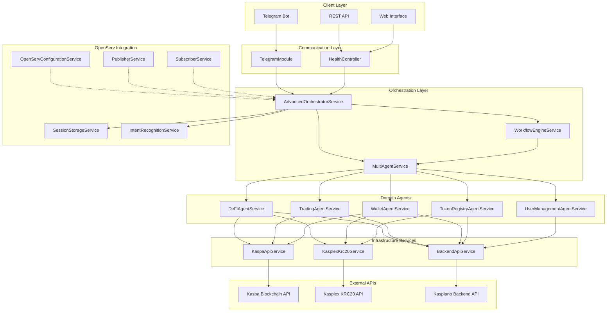
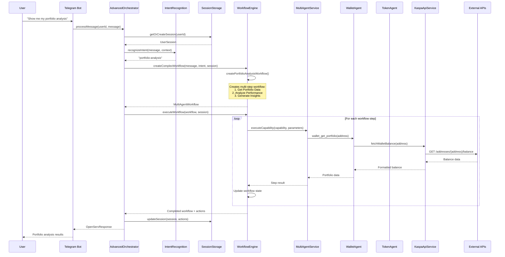

# Kaspa DeFi Agent Orchestration System

A sophisticated multi-agent DeFi orchestration platform built for the Kaspa ecosystem, featuring intelligent agent coordination, session management, and workflow automation.

## 🏗️ Architecture Overview



## 🔄 Process Flow Example: Portfolio Analysis Request



## 🎯 Service Responsibilities

### **Core Orchestration Layer**

#### AdvancedOrchestratorService
- **Primary Responsibility**: Main orchestration hub
- **Functions**:
  - Message processing and routing
  - User session management with memory persistence
  - Intent recognition coordination
  - Multi-agent workflow orchestration
  - Result synthesis and response generation
- **When Active**: On every user interaction
- **Key Methods**: `processMessage()`, `executeMultiAgentWorkflow()`, `executeSingleCapability()`

#### MultiAgentService
- **Primary Responsibility**: Agent coordination and capability execution
- **Functions**:
  - Dynamic agent routing based on capabilities
  - Parallel agent execution
  - Agent capability management
  - Cross-agent communication
- **When Active**: When capabilities need execution
- **Key Methods**: `executeCapability()`, `routeToAgent()`, `executeParallel()`

#### WorkflowEngineService
- **Primary Responsibility**: Multi-step workflow management
- **Functions**:
  - Workflow creation and execution
  - Step dependency management
  - Parameter resolution between steps
  - Workflow state persistence
  - Resume/pause functionality
- **When Active**: For complex multi-step operations
- **Key Methods**: `createComplexWorkflow()`, `executeWorkflow()`, `resumeWorkflow()`

### **OpenServ Integration Layer**

#### SessionStorageService
- **Primary Responsibility**: Session and memory management
- **Functions**:
  - User session persistence
  - Context compression and summarization
  - Session cleanup and timeout management
  - Memory optimization
- **When Active**: Throughout user interaction lifecycle
- **Key Methods**: `storeSession()`, `compressContext()`, `cleanupExpired()`

#### IntentRecognitionService
- **Primary Responsibility**: User intent analysis
- **Functions**:
  - Natural language intent extraction
  - Pattern matching and confidence scoring
  - Context-aware intent enhancement
  - Dynamic pattern learning
- **When Active**: On every user message
- **Key Methods**: `recognizeIntent()`, `extractEntities()`, `enhanceWithContext()`

#### OpenServConfigurationService
- **Primary Responsibility**: Platform configuration management
- **Functions**:
  - Agent configuration loading
  - Performance and memory settings
  - API endpoint configuration
  - Feature flag management
- **When Active**: During initialization and configuration updates
- **Key Methods**: `getAdvancedConfig()`, `getAgentConfigurations()`

### **Domain Agent Layer**

#### DeFiAgentService
- **Primary Responsibility**: DeFi protocol interactions
- **Capabilities**:
  - `defi_get_protocols`: List available DeFi protocols
  - `defi_get_pools`: Get liquidity pool information
  - `defi_calculate_yield`: Calculate yield opportunities
  - `defi_get_tvl`: Get Total Value Locked data
  - `defi_general_query`: Handle general DeFi questions
- **When Active**: For DeFi-related queries and operations

#### TradingAgentService
- **Primary Responsibility**: Trading operations and market analysis
- **Capabilities**:
  - `trading_get_market_data`: Real-time market information
  - `trading_get_order_book`: Order book analysis
  - `trading_execute_trade`: Trade execution coordination
  - `trading_get_price_history`: Historical price data
  - `trading_generate_strategy`: AI-powered trading strategies
- **When Active**: For trading and market analysis requests

#### WalletAgentService
- **Primary Responsibility**: Wallet management and portfolio tracking
- **Capabilities**:
  - `wallet_get_balance`: Get wallet balances
  - `wallet_get_portfolio`: Complete portfolio overview
  - `wallet_get_activity`: Transaction history and activity
  - `wallet_generate_insights`: Portfolio analysis and insights
  - `wallet_manage_addresses`: Multi-wallet management
- **When Active**: For wallet and portfolio operations

#### TokenRegistryAgentService
- **Primary Responsibility**: Token information and management
- **Capabilities**:
  - `token_get_info`: Token metadata and details
  - `token_get_price_history`: Price charts and trends
  - `token_search`: Token discovery and search
  - `token_get_holders`: Holder distribution analysis
  - `token_validate`: Token verification and validation
- **When Active**: For token research and validation

#### UserManagementAgentService
- **Primary Responsibility**: User preferences and management
- **Capabilities**:
  - `user_get_profile`: User profile management
  - `user_update_preferences`: Preference customization
  - `user_manage_notifications`: Notification settings
  - `user_get_activity`: User activity tracking
  - `user_manage_alerts`: Price and event alerts
- **When Active**: For user management operations

### **Infrastructure Layer**

#### KaspaApiService
- **Primary Responsibility**: Direct Kaspa blockchain interactions
- **Functions**:
  - Kaspa price data retrieval
  - Fee estimation and gas calculation
  - Wallet balance queries
  - UTXO management
  - Network information
- **When Active**: For all Kaspa blockchain operations
- **External Dependency**: Kaspa blockchain API

#### KasplexKrc20Service
- **Primary Responsibility**: KRC20 token operations
- **Functions**:
  - Token information retrieval
  - Wallet token balance queries
  - Token activity tracking
  - Mint status monitoring
  - Token deployment verification
- **When Active**: For KRC20 token operations
- **External Dependency**: Kasplex API

#### BackendApiService
- **Primary Responsibility**: Kaspiano backend integration
- **Functions**:
  - Trading operations and orders
  - User notifications and ads
  - Portfolio data aggregation
  - Market statistics
  - Authentication and referrals
- **When Active**: For advanced DeFi operations
- **External Dependency**: Kaspiano backend API

## 🎮 Currently Implemented Actions

### **✅ Working & Runnable Features**

#### **User Interaction**
- ✅ Telegram bot message handling
- ✅ REST API health checks
- ✅ User session creation and management
- ✅ Message context preservation
- ✅ Intent recognition and routing

#### **Agent Capabilities** (Mock Implementation Ready)
- ✅ DeFi protocol queries
- ✅ Trading market data retrieval
- ✅ Wallet balance and portfolio operations
- ✅ Token information and search
- ✅ User preference management

#### **Workflow Management**
- ✅ Multi-step workflow creation
- ✅ Workflow execution with dependency management
- ✅ Portfolio analysis workflows
- ✅ Token research workflows
- ✅ Trading strategy workflows
- ✅ Workflow pause/resume functionality

#### **Session & Memory**
- ✅ Session persistence (in-memory)
- ✅ Context compression and cleanup
- ✅ User preference storage
- ✅ Action history tracking
- ✅ Automatic session timeout

#### **Infrastructure Integration**
- ✅ Kaspa blockchain API connections
- ✅ Kasplex KRC20 API integration
- ✅ Backend API service integration
- ✅ HTTP service dependency injection
- ✅ Configuration management

### **🔧 TODO: Production Implementation**

#### **AI & Intelligence**
- 🔄 AI-powered intent recognition
- 🔄 Natural language processing
- 🔄 Intelligent workflow generation
- 🔄 Context-aware responses

#### **Database & Persistence**
- 🔄 Database session storage
- 🔄 User preference persistence
- 🔄 Workflow state database
- 🔄 Action history database

#### **Real-time Features**
- 🔄 Live price feeds
- 🔄 Real-time notifications
- 🔄 Streaming market data
- 🔄 WebSocket connections

#### **Security & Authentication**
- 🔄 User authentication system
- 🔄 Wallet connection verification
- 🔄 API key management
- 🔄 Rate limiting

## 🚀 Getting Started

### Prerequisites
- Node.js 18+
- NestJS CLI
- Telegram Bot Token
- API keys for external services

### Installation
```bash
npm install
npm run start:dev
```

### Configuration
Set up environment variables:
```env
TELEGRAM_BOT_TOKEN=your_bot_token
KASPA_API_BASE_URL=https://api.kaspa.org
KASPLEX_API_BASE_URL=https://api.kasplex.org/v1
BACKEND_API_BASE_URL=https://api.kaspiano.com
```

## 📱 Usage Examples

### Simple Queries
```
User: "What's my KAS balance?"
Bot: Executes wallet_get_balance → Returns current balance

User: "Show me KASPA token info"
Bot: Executes token_get_info → Returns token details
```

### Complex Workflows
```
User: "Analyze my portfolio performance"
Bot: Creates workflow:
  1. Get portfolio data
  2. Analyze performance metrics
  3. Generate insights and recommendations
```

## 🏛️ Architecture Benefits

- **🔧 Platform Agnostic**: Core orchestration independent of OpenServ
- **🎯 Modular Design**: Each agent handles specific domain responsibilities  
- **⚡ Scalable**: Easy to add new agents and capabilities
- **🧠 Intelligent**: Context-aware routing and workflow management
- **💾 Stateful**: Session management with memory persistence
- **🔄 Workflow-Driven**: Complex multi-step operations supported

## 🛠️ Development Status

**Current State**: ✅ **Fully Functional Architecture**
- All modules loading successfully
- Dependency injection working
- Agent orchestration operational
- Telegram integration active
- Ready for feature implementation and testing 