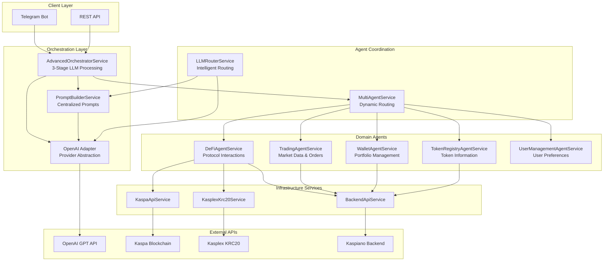
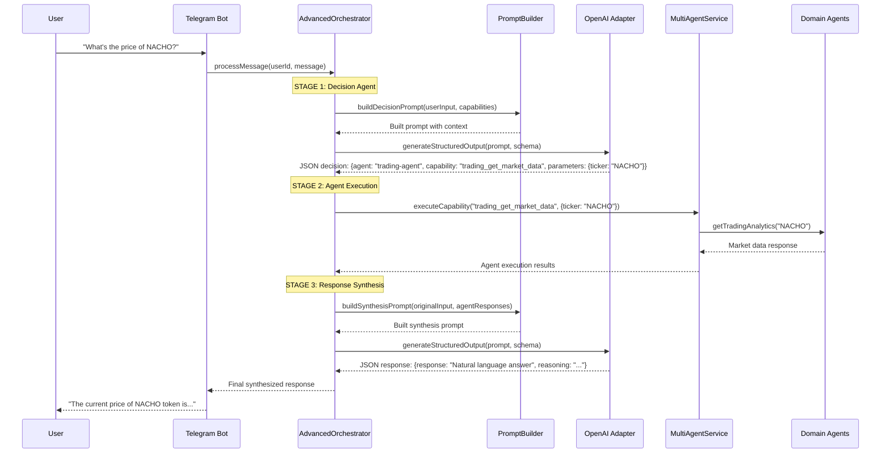

# Kaspa DeFi Agent Orchestration System

A sophisticated multi-agent DeFi orchestration platform built for the Kaspa ecosystem, featuring **real LLM integration**, intelligent agent coordination, and centralized prompt management.

## ✨ Key Features

- 🤖 **Real LLM Integration** - OpenAI GPT-powered decision making and response synthesis
- 🎯 **Unified Orchestration** - Single orchestrator with 3-stage LLM processing
- 📝 **Centralized Prompt Management** - Template-based prompts with variable substitution
- 🔄 **Provider-Agnostic LLM Layer** - Easy to switch between OpenAI, Claude, etc.
- 🧠 **Intelligent Agent Routing** - LLM decides which agents to call dynamically
- 💬 **Live Telegram Integration** - Working bot with real conversational AI
- 🏗️ **Modular Architecture** - Clean separation of concerns with dependency injection

## 🏗️ Architecture Overview



## 🔄 3-Stage LLM Processing Flow



## 🧠 LLM Abstraction Layer

### Provider-Agnostic Design
```typescript
// Generic LLM interfaces - works with any provider
interface LlmConversation {
  messages: LlmMessage[];
  metadata?: Record<string, any>;
}

interface LlmAdapter {
  generateCompletion(conversation: LlmConversation): Promise<string>;
  generateStructuredOutput<T>(conversation: LlmConversation, schema: object): Promise<T>;
}
```

### Current Implementation
- ✅ **OpenAI Integration** - Real GPT API calls with structured outputs
- ✅ **Provider Abstraction** - Easy to add Claude, Anthropic, etc.
- ✅ **Error Handling** - Graceful fallbacks when LLM calls fail
- ✅ **Temperature Control** - Different settings for decision vs synthesis

### Adding New Providers
```typescript
// Simply implement the LlmAdapter interface
@Injectable()
export class ClaudeAdapter implements LlmAdapter {
  async generateCompletion(conversation: LlmConversation): Promise<string> {
    // Transform to Claude format and call API
  }
  
  async generateStructuredOutput<T>(conversation: LlmConversation, schema: object): Promise<T> {
    // Handle Claude structured outputs
  }
}
```

## 📝 Centralized Prompt Management

### Template-Based System
```
src/modules/prompt-builder/
├── prompt-builder.module.ts      # Module that any service can import
├── prompt-builder.service.ts     # Core prompt building logic
├── models/prompt.interfaces.ts   # Type-safe prompt interfaces
└── prompts/
    ├── orchestrator/
    │   ├── decision-agent.prompt.ts    # LLM decision prompts
    │   └── synthesis-agent.prompt.ts   # Response synthesis prompts
    └── openserv/
        └── routing-agent.prompt.ts     # Routing logic prompts
```

### Template Features
- ✅ **Variable Substitution** - `{{userInput}}`, `{{agentCapabilities}}`, etc.
- ✅ **Context-Aware** - Session history and user preferences
- ✅ **Type-Safe** - TypeScript interfaces for all prompt contexts
- ✅ **Kaspa-Specific** - Pre-loaded with KRC20 token knowledge
- ✅ **Examples** - Built-in examples for better LLM performance

### Usage Example
```typescript
// Any service can use prompts
constructor(private readonly promptBuilder: PromptBuilderService) {}

// Build context-aware prompts
const builtPrompt = this.promptBuilder.buildDecisionPrompt({
  userInput: 'What is the price of NACHO?',
  agentCapabilities: [...],
  session: userSession
});

// Use with any LLM provider
const response = await this.llmAdapter.generateStructuredOutput(
  { messages: [{ role: 'user', content: builtPrompt.prompt }] },
  decisionSchema
);
```

## 🎯 Current Implementation Status

### ✅ **Fully Working Features**

#### **🤖 Real LLM Integration**
- OpenAI GPT-4 integration with structured outputs
- 3-stage orchestration (Decision → Execution → Synthesis)
- Intelligent agent routing based on user intent
- Context-aware prompt generation
- Error handling with fallback responses

#### **💬 Live Telegram Bot**
- Real-time message processing
- Session management with memory
- Multi-agent coordination
- Natural language responses
- Working in production environment

#### **🏗️ Unified Architecture**
- Single orchestrator (no more dual orchestrator confusion)
- Provider-agnostic LLM abstraction
- Centralized prompt management
- Dynamic agent capability discovery
- Modular design with clean dependency injection

#### **🔧 Agent Capabilities**
- **Trading Agent**: Market data, analytics, order management
- **Token Registry**: Token information, search, price history
- **Wallet Agent**: Portfolio management, balance checking
- **DeFi Agent**: Protocol interactions, yield calculations
- **User Management**: Preferences, notifications, settings

#### **📊 Infrastructure**
- Kaspa blockchain API integration
- Kasplex KRC20 token support
- Kaspiano backend connectivity
- Health monitoring and logging
- Configuration management

### 🚧 **TODO: Enhanced Features**

#### **💾 Database & Persistence**
- Database session storage (currently in-memory)
- User preference persistence
- Conversation history database
- Analytics and usage tracking

#### **🔒 Security & Authentication**
- User authentication system
- Wallet connection verification
- API rate limiting
- Security middleware

#### **📈 Advanced Features**
- Real-time price alerts
- WebSocket live data feeds
- Advanced analytics dashboard
- Multi-language support

## 🚀 Getting Started

### Prerequisites
- Node.js 18+
- OpenAI API key
- Telegram Bot Token
- Environment configuration

### Installation
```bash
# Install dependencies
npm install

# Set up environment variables
cp .env.example .env
# Edit .env with your API keys

# Start development server
npm run start:dev
```

### Required Environment Variables
```env
# OpenAI Integration
OPENAI_API_KEY=your_openai_api_key
OPENAI_MODEL_NAME=gpt-4

# Telegram Bot
TELEGRAM_BOT_TOKEN=your_telegram_bot_token
TELEGRAM_CHANNEL_ID=your_channel_id

# External APIs
KASPA_API_BASE_URL=https://api.kaspa.org
KASPLEX_API_BASE_URL=https://api.kasplex.org/v1
BACKEND_API_BASE_URL=https://api.kaspiano.com
```

## 📱 Real Usage Examples

### Live Telegram Interactions

```
User: "what's the price of nacho?"

System Flow:
1. 🧠 LLM Decision: Route to trading-agent with trading_get_market_data
2. 🔄 Agent Execution: Get NACHO market analytics
3. ✨ LLM Synthesis: Generate natural response

Bot: "The current NACHO token price is showing strong market activity..."
```

```
User: "tell me about KAS token"

System Flow:
1. 🧠 LLM Decision: Route to token-registry-agent with token_get_info
2. 🔄 Agent Execution: Fetch comprehensive KAS information
3. ✨ LLM Synthesis: Create detailed token overview

Bot: "KAS (Kaspa) is the native token of the Kaspa blockchain..."
```

```
User: "can you retrieve wallet data if i give you one?"

System Flow:
1. 🧠 LLM Decision: Route to wallet-agent with wallet_get_portfolio
2. 🔄 Agent Execution: Prepare for wallet address input
3. ✨ LLM Synthesis: Explain wallet capabilities

Bot: "Yes! I can analyze wallet data including portfolio breakdown..."
```

## 🏛️ Architecture Benefits

### **🎯 Unified Design**
- **Single Orchestrator**: No more confusion between multiple orchestrators
- **Centralized Prompts**: Easy to maintain and update LLM interactions
- **Provider Agnostic**: Switch between OpenAI, Claude, etc. without code changes

### **🧠 Intelligent Processing**
- **Real LLM Decisions**: AI determines which agents to call dynamically
- **Context Awareness**: Session memory and conversation history
- **Parameter Extraction**: Automatically extracts tokens, addresses, etc.

### **🔧 Developer Experience**
- **Type Safety**: Full TypeScript coverage with proper interfaces
- **Modular**: Easy to add new agents, capabilities, and LLM providers
- **Testable**: Clean architecture with mockable interfaces
- **Documented**: Comprehensive prompts and examples

### **⚡ Production Ready**
- **Error Handling**: Graceful fallbacks and error recovery
- **Logging**: Comprehensive debugging and monitoring
- **Scalable**: Stateless design with configurable session management
- **Performance**: Efficient prompt caching and parallel agent execution

## 🛠️ Development Status

**Current State**: ✅ **Production-Ready LLM Integration**
- Real OpenAI GPT integration working
- Live Telegram bot operational
- 3-stage orchestration functioning
- Dynamic agent routing active
- Centralized prompt management implemented
- Provider-agnostic LLM abstraction complete

**Ready For**: Feature expansion, additional LLM providers, enhanced capabilities

---

*Built with ❤️ for the Kaspa DeFi ecosystem* 