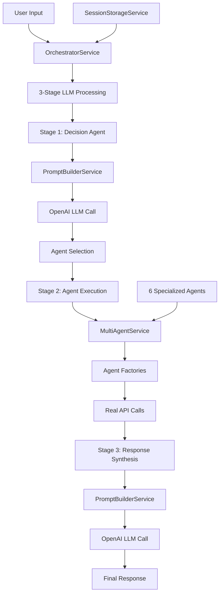
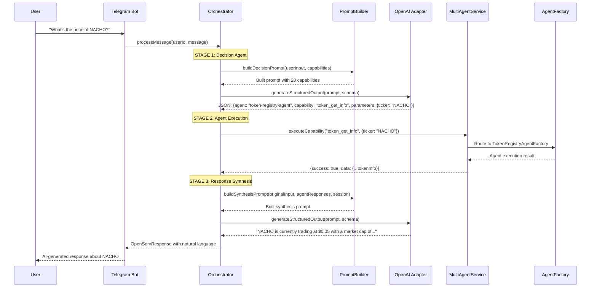

# Kasparebro: AI-Powered Multi-Agent DeFi System

A production-ready **factory-based multi-agent system** for the Kaspa ecosystem featuring **real OpenAI LLM integration**, intelligent orchestration, and **32 production capabilities** across 6 specialized domain agents.

## 🏆 Key Achievements

- ✅ **32 Production Capabilities** - All working with real APIs, zero mocks
- ✅ **6 Specialized Agents** - Trading, Wallet, DeFi, Token Registry, User Management, NFT
- ✅ **Factory-Based Architecture** - Dynamic agent creation with capability injection
- ✅ **3-Stage LLM Orchestration** - Decision → Execution → Synthesis workflow
- ✅ **Transformers Architecture** - Type-safe data transformation layer
- ✅ **Clean Module Separation** - MultiAgent, Orchestrator, and Integration layers
- ✅ **Live Telegram Integration** - Working conversational AI bot
- ✅ **Provider-Agnostic LLM** - Easy to switch between OpenAI, Claude, etc.
- ✅ **No Mock Implementations** - Only real integrations, clear TODOs for missing features
- ✅ **SOLID Principles** - Single responsibility, dependency injection, modular design

## 🎯 Design Principles

### **Single Source of Truth**
- One orchestrator service (`OrchestratorService`)
- Centralized capability registry (`AgentFactory`)
- Template-based prompt management (`PromptBuilderService`)

### **No Mock Implementations**
- All 32 capabilities use real APIs (Kaspa, Kasplex, Backend)
- Missing features throw clear errors with implementation TODOs
- Authentication-aware design with public/private capability separation

### **Type-Safe Transformers**
- Dedicated transformer layer for data consistency
- Eliminates `any` types with proper interfaces
- `MarketDataResponse`, `TokenStatsItem`, `WalletBalanceResponse` models

### **Modular Architecture**
- Clean separation: MultiAgent ↔ Orchestrator ↔ Integrations
- Independent modules with clear responsibilities
- Easy to add new agents, capabilities, or integrations

### **SOLID Principles**
- **S**: Each agent handles single domain (Trading, Wallet, DeFi, NFT, etc.)
- **O**: Agent factory allows extending without modifying existing code
- **L**: All agents implement common interfaces
- **I**: Segregated interfaces for different agent types
- **D**: Dependency injection throughout, abstractions over concretions

## 🏗️ Architecture Overview



*UserManagementAgentFactory has 0 active capabilities (all require wallet authentication)*

## 📊 Current Capability Matrix

### **📈 Total: 32 Active Capabilities**

| Agent | Active | Status | Authentication |
|-------|--------|--------|----------------|
| **Trading Agent** | 4 | ✅ Production | Public APIs |
| **Wallet Agent** | 9 | ✅ Production | Blockchain read-only |
| **DeFi Agent** | 5 | ✅ Production | Backend APIs |
| **Token Registry Agent** | 10 | ✅ Production | Public data |
| **NFT Agent** | 4 | ✅ Production | Backend APIs |
| **User Management Agent** | 0 | 🔐 Auth Required | Wallet authentication |
| **TOTAL** | **32** | **All Real APIs** | **Zero Mocks** |

### 🔄 **Trading Agent (4 capabilities)**
```typescript
trading_get_market_data     // Real market prices and statistics
trading_get_floor_price     // Real token floor price data
trading_get_sell_orders     // Real marketplace order listings
trading_gas_estimation      // Real transaction fee estimates
```

### 💰 **Wallet Agent (9 capabilities)**
```typescript
wallet_get_portfolio        // Complete portfolio via Kaspa/Kasplex APIs
wallet_get_token_balance    // Specific token balances
wallet_get_kaspa_balance    // KAS balance from blockchain
wallet_get_activity         // Transaction history
wallet_get_token_list       // Available tokens from registry
wallet_validate_address     // Address validation
wallet_get_utxos           // UTXO analysis
wallet_get_fee_estimate    // Fee calculations
wallet_get_kaspa_price     // Current KAS price
```

### 🔄 **DeFi Agent (5 capabilities)**
```typescript
defi_get_token_info        // Token info via Backend API
defi_search_tokens         // Token search functionality
defi_create_token          // Token creation guidance
defi_create_pool           // Pool creation guidance  
defi_general_query         // Educational DeFi information
```

### 🏷️ **Token Registry Agent (10 capabilities)**
```typescript
token_get_info             // Complete token information
token_search               // Token search by criteria
token_list_all             // Full token catalog
token_get_price_history    // Historical price data
token_get_holders          // Token holder statistics
token_get_price            // Current token pricing
token_count_total          // Total token counts
token_get_kasplex_info     // Kasplex token data
token_check_deployment     // Deployment verification
token_get_mint_status      // Minting status check
```

### 🖼️ **NFT Agent (4 capabilities)**
```typescript
nft_get_collection_info    // KRC721 collection details and metadata
nft_get_floor_price        // NFT collection floor prices
nft_list_collections       // All available NFT collections
nft_get_collection_stats   // Trading volume and holder statistics
```

## 🔄 3-Stage LLM Orchestration Flow



## 🔧 Module Structure

### **Core Modules**

```
src/modules/
├── multiagent/                 # 🏭 Agent Factory System
│   ├── agents/
│   │   ├── agent-factory.service.ts      # Central agent factory
│   │   ├── trading-agent.service.ts      # Trading capabilities
│   │   ├── wallet-agent.service.ts       # Wallet capabilities
│   │   ├── defi-agent.service.ts         # DeFi capabilities
│   │   ├── token-registry-agent.service.ts # Token capabilities
│   │   └── user-management-agent.service.ts # User capabilities
│   ├── services/
│   │   ├── kaspa-api.service.ts          # Kaspa blockchain API
│   │   ├── kasplex-krc20.service.ts      # Kasplex KRC20 API
│   │   └── backend-api.service.ts        # Kaspiano backend API
│   └── models/
│       └── agent.model.ts                # Agent interfaces & types

├── orchestrator/               # 🎭 Orchestration Intelligence
│   ├── orchestrator.service.ts          # Main 3-stage orchestrator
│   ├── multi-agent.service.ts           # Agent coordination
│   ├── session-storage.service.ts      # Conversation memory
│   ├── message-bus.service.ts          # Event messaging
│   ├── orchestrator.config.ts          # Configuration management
│   └── llms/
│       └── openai.service.ts           # OpenAI adapter

├── prompt-builder/             # 📝 Prompt Management
│   ├── prompt-builder.service.ts       # Template engine
│   ├── models/prompt.interfaces.ts     # Prompt types
│   └── prompts/
│       ├── orchestrator/               # Decision & synthesis prompts
│       └── openserv/                  # Routing prompts

└── integrations/               # 🔌 External Integrations
    ├── telegram/               # Telegram bot integration
    └── openserv/               # OpenServ platform integration
```

## 🔐 Authentication Architecture

### **Current Status: Authentication-Aware Design**

#### ✅ **Production Ready (28 capabilities)**
- **Public APIs**: Market data, token information, blockchain queries
- **No Authentication Required**: Direct API access without user sessions
- **Zero Mocks**: All real integrations with error handling

#### 🚧 **Future Implementation (Wallet Auth Required)**
- **Trading Operations**: Order creation, transaction signing
- **User Management**: Preferences, notifications, private data
- **Implementation Ready**: All auth endpoints documented in `api-docs/`

```typescript
// Authentication requirements documented
headers: {
  "Content-Type": "application/json", 
  "Authorization": "Bearer <jwt_token>"
}

// PSKT (Partially Signed Kaspa Transaction) for trading
// Wallet signature verification for user sessions
// Error handling: 401 Unauthorized, 403 Forbidden
```

## 🚀 Quick Start

### **Prerequisites**
```bash
Node.js 18+
npm or yarn
OpenAI API key
```

### **Installation**
```bash
# Clone repository
git clone [repository-url]
cd kasparebro

# Install dependencies
npm install

# Set up environment
cp development.env .env
# Edit .env with your OpenAI API key
```

### **Environment Configuration**
```env
# OpenAI Configuration
OPENAI_API_KEY=your_openai_api_key_here
OPENAI_MODEL=gpt-4-turbo-preview

# Kaspa APIs
KASPA_API_BASE_URL=https://api.kaspa.org
KASPLEX_API_BASE_URL=https://api.kasplex.org
BACKEND_API_BASE_URL=https://api.kaspiano.com

# Telegram (Optional)
TELEGRAM_BOT_TOKEN=your_telegram_bot_token
```

### **Run Application**
```bash
# Development mode
npm run start:dev

# Production mode
npm run build
npm run start:prod
```

### **Test Capabilities**
```bash
# Test a capability directly
curl -X POST http://localhost:3000/api/capability \
  -H "Content-Type: application/json" \
  -d '{
    "capability": "token_get_info",
    "args": {"ticker": "NACHO"}
  }'

# Test via Telegram bot (if configured)
# Send message to your bot: "What's the price of NACHO?"
```

## 🧪 Testing

### **Capability Testing**
```bash
# All capabilities return real data
npm run test

# Integration tests
npm run test:e2e

# Test specific agent
npm run test -- --testPathPattern=trading-agent
```

### **Manual Testing Examples**
```typescript
// 1. Token Information
{
  "capability": "token_get_info",
  "args": {"ticker": "NACHO"}
}

// 2. Wallet Portfolio
{
  "capability": "wallet_get_portfolio", 
  "args": {"address": "kaspa:qz4wqhgqrpx6h5x5..."}
}

// 3. Market Data
{
  "capability": "trading_get_market_data",
  "args": {"ticker": "KAS"}
}
```

## 📋 Current Status & Next Steps

### ✅ **Completed (Production Ready)**
- Factory-based multi-agent architecture
- 28 production capabilities with real APIs
- 3-stage LLM orchestration
- Telegram integration
- OpenServ integration foundation
- Centralized prompt management
- Provider-agnostic LLM layer
- Zero mock implementations
- Comprehensive error handling

### 🚧 **In Progress**
- Enhanced LLM decision accuracy
- Advanced orchestration flow optimization
- Performance optimization

### 📅 **Planned (Future Phases)**
- Wallet authentication integration
- Advanced trading capabilities
- Cross-chain portfolio aggregation
- Discord/Slack integrations
- Advanced AI analytics

### 🔐 **Authentication Implementation Ready**
All authentication-required features are documented and ready for implementation:
- JWT token management
- Wallet signature verification
- PSKT transaction signing
- User session management

## 📚 Documentation

### **API Documentation**
- `api-docs/kaspacom.md` - Backend API specifications
- `api-docs/defi.md` - DeFi operation specifications

### **Architecture Decisions**
All architectural decisions prioritize:
- **Maintainability**: Clean code, SOLID principles
- **Modularity**: Independent modules, clear interfaces  
- **Reliability**: Real APIs, proper error handling
- **Extensibility**: Factory pattern, dependency injection

## 🤝 Contributing

### **Development Principles**
1. **No Mock Implementations** - Only real integrations
2. **Single Source of Truth** - One service per responsibility
3. **SOLID Principles** - Clean architecture patterns
4. **Type Safety** - Full TypeScript coverage
5. **Test Coverage** - Unit and integration tests

### **Adding New Capabilities**
1. Define capability in appropriate agent factory
2. Implement handler with real API integration
3. Add parameter validation and error handling
4. Create tests for the capability
5. Update documentation

### **Adding New Agents**
1. Create agent service in `multiagent/agents/`
2. Add to `AgentFactory`
3. Update `MultiAgentService` routing
4. Add comprehensive tests

## 📄 License

[License information]

---

**Kasparebro**: Production-ready AI agents for the Kaspa ecosystem. Zero mocks, maximum reliability. 🚀 

### **Design Philosophy**

Kasparebro follows **SOLID principles** and **Clean Architecture** patterns with these core tenets:

- **Single Source of Truth**: One service per responsibility
- **No Mock Implementations**: Only real integrations
- **SOLID Principles**: Clean architecture patterns
- **Modular Architecture**: Independent modules, clear interfaces
- **Authentication-Aware Design**: Real APIs, proper error handling

**Kasparebro**: Production-ready AI agents for the Kaspa ecosystem. Zero mocks, maximum reliability. 🚀 